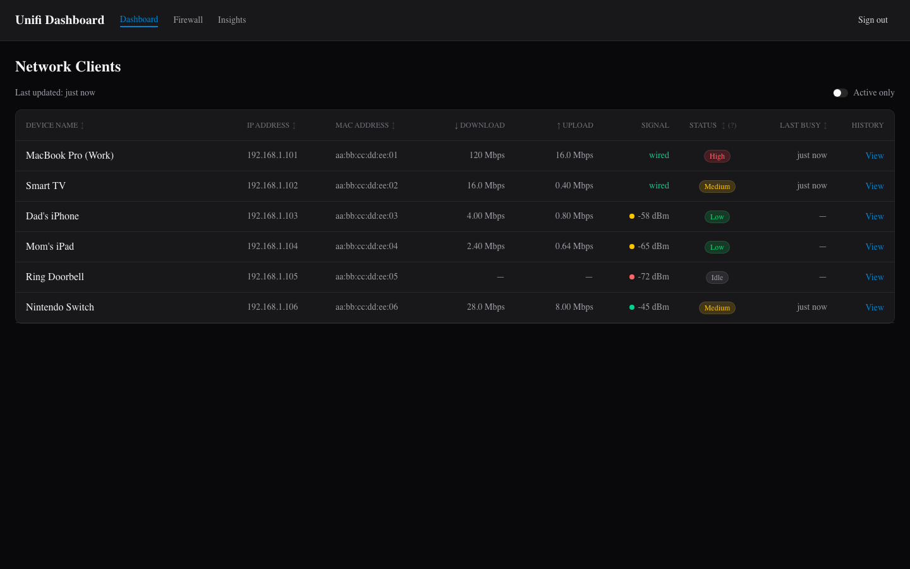
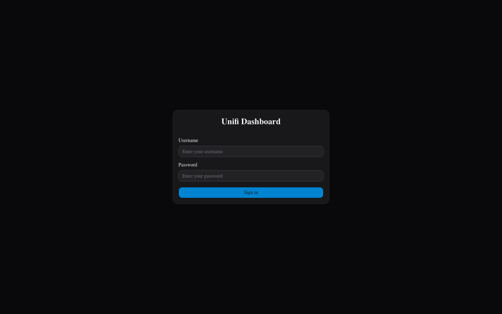
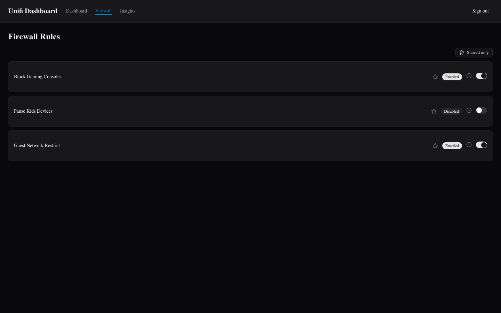
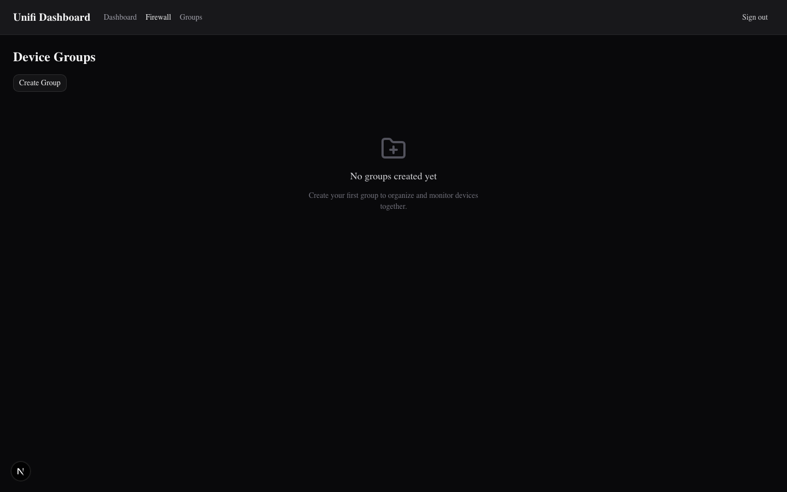

# Unifi Network Dashboard

A self-hosted web app for monitoring home network traffic and managing firewall rules on a UniFi OS console. Run it on any always-on machine on your LAN — a Mac Mini, NAS, or server — and open it from any device on the network.



## What it does

- **Live bandwidth status** — see which devices are idle, low, medium, or high traffic at a glance
- **Firewall rule toggles** — pause and resume internet access for devices or groups without logging into the UniFi console
- **Device groups** — organise devices (e.g. "Kids", "Work") and apply rules to the whole group
- **Traffic insights** — hourly heatmap and top-devices chart showing bandwidth usage over time (up to 30 days)

Built for a family household. Connects to the UniFi console directly over LAN using the local API.

### Screenshots

| Login | Dashboard | Firewall | Groups |
|-------|-----------|----------|--------|
|  |  |  |  |

> Screenshots taken with mock data — no real UniFi console required for local development.

---

## Quick Start (Docker on LAN)

The recommended way to run this in your home. Takes about 5 minutes.

### Prerequisites

- A machine on your LAN that stays on (Mac Mini, NAS, Linux server, etc.)
- [Docker Desktop](https://www.docker.com/products/docker-desktop/) installed and running on that machine
- The repository cloned on that machine

```bash
git clone <repo-url>
cd unifi-api
```

### 1. Create your env file

```bash
cp .env.prod.example .env.prod
```

Open `.env.prod` and fill in every value:

```bash
# Your UniFi console's LAN IP (find it in UniFi OS > Settings)
UNIFI_HOST=192.168.1.1

# API key from UniFi OS > Settings > API > Create API Key
UNIFI_API_KEY=your-api-key-here

# App login credentials (passwords must be bcrypt hashes — see below)
ADMIN_USER=admin
ADMIN_PASSWORD=$2a$10$...

FAMILY_USER=family
FAMILY_PASSWORD=$2a$10$...

# JWT signing secret — must be 32+ characters
SESSION_SECRET=<generated-secret>

# Port to expose on your LAN (default: 3000)
PORT=3000
```

**Generate a bcrypt password hash** (run from the project directory after `npm install`, or use `npx`):

```bash
node -e "console.log(require('bcryptjs').hashSync('your-password', 10))"
# or without npm install:
npx --package=bcryptjs node -e "console.log(require('bcryptjs').hashSync('your-password', 10))"
```

Paste the output (starts with `$2a$10$...`) as the value for `ADMIN_PASSWORD` or `FAMILY_PASSWORD`.

**Generate SESSION_SECRET:**

```bash
openssl rand -hex 32
```

### 2. Start the container

```bash
docker compose up -d --build
```

The first build takes a few minutes. After that, starts instantly.

### 3. Open on any device

On any device connected to the same network, open a browser and go to:

```
http://<host-machine-ip>:3000
```

Replace `<host-machine-ip>` with the LAN IP of the machine running Docker — **not** your UniFi console IP. Log in with the plaintext password you chose (not the hash).

The container restarts automatically on reboot (`restart: unless-stopped`).

### Updating

```bash
git pull
docker compose up -d --build
```

### Stopping

```bash
docker compose down
```

### Docker troubleshooting

**App not reachable from other devices**
The host machine's firewall may be blocking port 3000. On macOS, Docker Desktop handles this automatically. On Linux: `sudo ufw allow 3000`.

**Container shows as unhealthy**
The healthcheck pings `/api/health` every 30 seconds. On slow hardware it may briefly show `starting`. Check logs: `docker compose logs app`.

**"permission denied" errors in logs**
The container runs as a non-root `node` user. Check that the `data/` volume path is accessible.

---

## Development (Mock Mode)

Try the app locally without a UniFi console — mock data is built in.

```bash
./dev.sh
```

Opens on http://localhost:3000 with simulated devices and firewall rules. No `.env.local` needed.

| Username | Password |
|----------|----------|
| `admin`  | `admin`  |
| `family` | `family` |

Mock data includes 6 devices (MacBook Pro, Smart TV, iPhones, iPad, Ring Doorbell, Nintendo Switch) with varying traffic levels, and 3 firewall policies with working toggle controls.

**With a real UniFi console:**

```bash
cp .env.local.example .env.local
# fill in UNIFI_HOST, UNIFI_API_KEY, and credentials
npm run dev
```

---

## Tech Stack

- Next.js 16 (App Router, Server Components, standalone output)
- React 19
- TypeScript 5
- Tailwind CSS 4
- shadcn/ui
- jose (JWT session signing, HS256)
- bcryptjs (password hashing)
- ky (HTTP client for UniFi API)
- better-sqlite3 (local traffic history)
- Recharts (traffic charts)
- Vitest (unit and integration tests)

---

## Alternative: PM2 (no Docker)

If Docker is not available, run the app directly with [PM2](https://pm2.keymetrics.io/).

### Prerequisites

- Node.js 22
- `npm install -g pm2`

### Setup

```bash
npm install
npm run build
cp .env.prod.example .env.prod
# fill in .env.prod
set -a; source .env.prod; set +a
pm2 start ecosystem.config.cjs
pm2 save
```

Open: `http://<host-machine-ip>:3000`

**Auto-start on boot:**

```bash
# Ubuntu Server
pm2 startup systemd
# (run the command PM2 prints, then:)
sudo systemctl enable pm2-$USER

# macOS
pm2 startup launchd
# (run the command PM2 prints)
```

**Updating:**

```bash
git pull && npm install && npm run build && pm2 restart unifi-api
```

**Logs:** `pm2 logs unifi-api`

---

## Environment Variable Reference

| Variable | Required | Purpose |
|---|---|---|
| `UNIFI_HOST` | Yes* | LAN IP or hostname of your UniFi console, e.g. `192.168.1.1` |
| `UNIFI_API_KEY` | Yes* | API key from UniFi OS > Settings > API |
| `UNIFI_API_VERSION` | No | `v2` (default) or `v1` for older firmware |
| `ADMIN_USER` | Yes | Admin login username |
| `ADMIN_PASSWORD` | Yes | bcrypt hash of admin password |
| `FAMILY_USER` | Yes | Family login username |
| `FAMILY_PASSWORD` | Yes | bcrypt hash of family password |
| `SESSION_SECRET` | Yes | 32+ character random string for JWT signing |
| `UNIFI_MOCK` | No | Set to `true` to use mock data (skips real API calls) |
| `PORT` | No | Port to listen on (default: `3000`) |
| `SECURE_COOKIES` | No | Set to `true` only if serving over HTTPS |

*Not required when `UNIFI_MOCK=true`.

---

## Testing

```bash
npm test            # watch mode
npm run test:run    # single run (CI)
```

No `.env.local` needed — test credentials are baked into `vitest.config.ts`.

## Linting and Type Checking

```bash
npm run lint
npx tsc --noEmit
```

---

## Vercel UAT (Mock Mode)

Deploy to Vercel with mock data for UAT or PR previews — no real console needed.

1. Copy `.env.vercel-mock` values into Vercel's Environment Variables (target: **Preview** only)
2. Push your branch — Vercel deploys automatically

UAT credentials: `admin` / `uat-admin` · `family` / `uat-family`

---

## Project Structure

```
src/
  app/              # Next.js App Router
    (auth)/         # Login route
    (dashboard)/    # Protected dashboard (clients, firewall, groups, insights)
    api/            # API routes (/api/clients, /api/firewall, /api/insights/*)
    actions/        # Server Actions (auth)
  components/       # React components
  lib/
    unifi/          # UniFi API client + mock layer
    db/             # SQLite traffic recorder
    session.ts      # JWT session helpers
docs/
  screenshots/      # App screenshots (mock server)
  unifi-client.md   # UniFi API client internals
  UNIFI-API-FINDINGS.md
tests/              # Vitest suite
```

See [docs/unifi-client.md](docs/unifi-client.md) for how the UniFi API client works, and [docs/UNIFI-API-FINDINGS.md](docs/UNIFI-API-FINDINGS.md) for API research findings.

---

## License

[MIT](LICENSE) © Faiser
